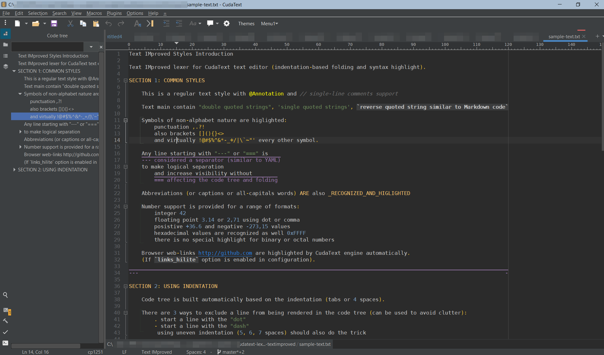

# cudatext-lexer-textimproved

Text IMproved lexer for CudaText text editor (indentation-based folding and syntax highlight).

This lexer was designed with the `Darcula` theme in mind.

This is how both work together to mimic the IntelliJ IDEA dark theme.

## Installation

- copy `./lexlib/*` to `./data/lexlib` directory of CudaText
- restart CudaText and select the `Text IMproved` lexer in settings
